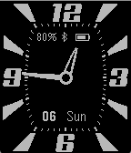

ShoMaurice Watchface for Pebble
===========================

This is a highly readable analog watchface for the [Pebble Smartwatch][pebble], intended for every-day use.

This version is built on the [Pebble SDK 3.7][sdk3], the project is a simplified version of the incredibly good-looking [Maurice][maurice] Pebble watchface.

Contributions are highly welcome - just send me a [pull request][pullreq].

-- Sam, Dec 2015

[pebble]:  https://getpebble.com/
[maurice]: https://github.com/zalewszczak/pebble/tree/master/maurice
[sdk3]:    https://developer.getpebble.com/sdk/changelogs/3.7/
[pullreq]: https://help.github.com/articles/using-pull-requests
